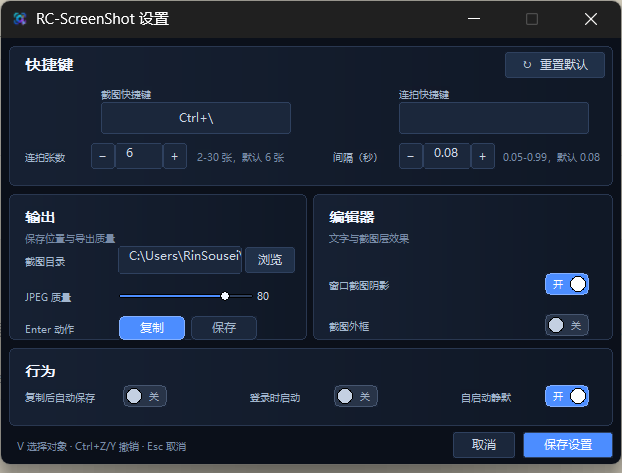
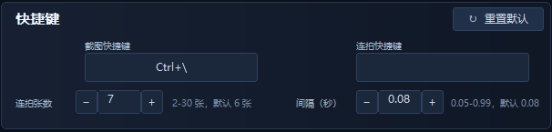

# RC-ScreenShot


面向 Windows 10 1903+ x64 的轻量原生截图工具。基于 DXGI 1.5、D3D11 和 Direct2D，专注于快速捕获、精确标注和高质量导出。

## 功能特色

- 支持 SDR、WCG 和 HDR 桌面捕获；HDR 场景优先使用 DXGI，SDR 场景提供 GDI 兜底。
- 支持普通框选、窗口吸附和原图单元识别，快速定位需要截取的内容。
- 支持 GPU 加速标注：画笔、矩形、椭圆、直线、箭头、文字、马赛克和外框。
- 文字支持横排与竖排，可调整字体、字号、颜色、透明度和阴影。
- 支持马赛克像素化、模糊和框选马赛克，敏感内容处理更灵活。
- 支持剪贴板复制、JPEG 保存，以及带 gain map 的 Ultra HDR JPEG 导出。
- 支持多组截图快捷键；默认 `Ctrl+\` 截图，`Alt+\` 连拍。
- 支持 2-30 帧连拍和 0.05-0.99 秒间隔，默认 6 帧、0.08 秒。
- 设置中心支持快捷键、连拍参数、输出目录、JPEG 质量和启动行为配置。
- 原生 C++20 实现，无运行时框架依赖，适合直接解压使用。

### 功能界面

设置中心将快捷键、连拍、输出、编辑器和启动行为集中在一个窗口中：



快捷键和连拍参数可独立配置，连拍张数支持 2-30 帧，间隔支持 0.05-0.99 秒：



## 下载

前往 [Latest Release](https://github.com/JDui/RC-ScreenShot/releases/latest) 下载最新版。

当前版本：**0.4.3**

发布包为 Windows x64 便携版 ZIP：下载后解压，直接运行 `RC-ScreenShot.exe`，无需安装。

## 使用说明

### 截图与选择

- 默认截图热键：`Ctrl+\`；可在设置中按行添加多组热键。
- 截图中按空格循环普通、窗口、单元模式。
- 连拍热键默认：`Alt+\`；可在设置中修改、清空或关闭。

### 标注工具

- `P` 画笔
- `R` 矩形
- `E` 椭圆
- `L` 直线
- `A` 箭头
- `T` 文字
- `M` 马赛克
- `Shift+M` 框选马赛克
- `F` 外框

工具栏第二行提供尺寸滑条、颜色预设和当前工具的详细参数；编辑区右键可打开完整工具与参数菜单。

选择文字工具后点击选区输入内容，`Enter` 确认，`Esc` 取消；横排/竖排可在参数栏或右键菜单切换。

### 常用快捷键

- `[` / `]`：调整尺寸
- `C`：选择颜色
- `O`：循环透明度
- `Ctrl+Z` / `Ctrl+Y`：撤销 / 重做
- `Ctrl+C`：复制
- `Ctrl+S`：保存
- `Enter`：执行设置中的默认动作
- `Esc`：取消

命令行接口：`--silent`、`--capture`、`--settings`。配置以 UTF-8 JSON 原子写入 EXE 同目录的 `RC-ScreenShot.config.json`。

## 已知平台限制

- 不捕获安全桌面，也不绕过 DRM 或受保护内容。
- 窗口模式裁剪冻结桌面画面；窗口被遮挡的部分不会被重新抓取。
- HDR 显示器上若 DXGI 捕获不可用，应用会拒绝错误的 GDI 降级；SDR 显示器可使用 GDI 兜底。
- 当前版本不包含 OCR、滚动截图、云上传、截图历史和 ARM64。

## 开发构建

需要 Visual Studio 2022（Desktop development with C++）、Windows 10/11 SDK 和 CMake 3.24+。

完整构建、测试并安装 Release 版本：

```powershell
powershell -ExecutionPolicy Bypass -File .\build.ps1 -Preset windows-release -Test -Install
```

快速开发构建可暂时关闭 HDR JPEG 编码器：

```powershell
powershell -ExecutionPolicy Bypass -File .\build.ps1 -Preset windows-fast -Test
```

## 第三方组件

Ultra HDR 编码使用 Google/AOSP `libultrahdr`，固定使用 commit `b2aacb366e1542cfc29605cb0d8a0ebd06bb07f8`，遵循 Apache-2.0 或 MIT 双许可证。构建时静态链接 JPEG 依赖，并写入 Ultra HDR XMP 与 ISO 21496-1 元数据。Windows 平台 API 和编解码器由系统提供。
